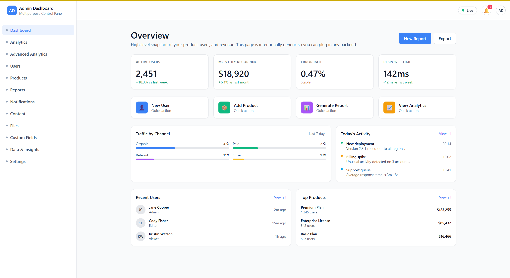
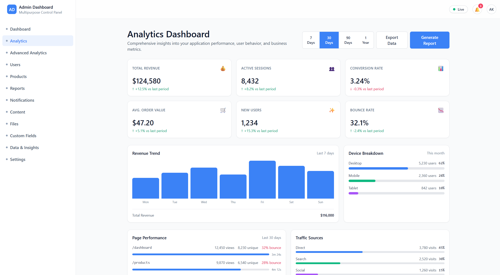
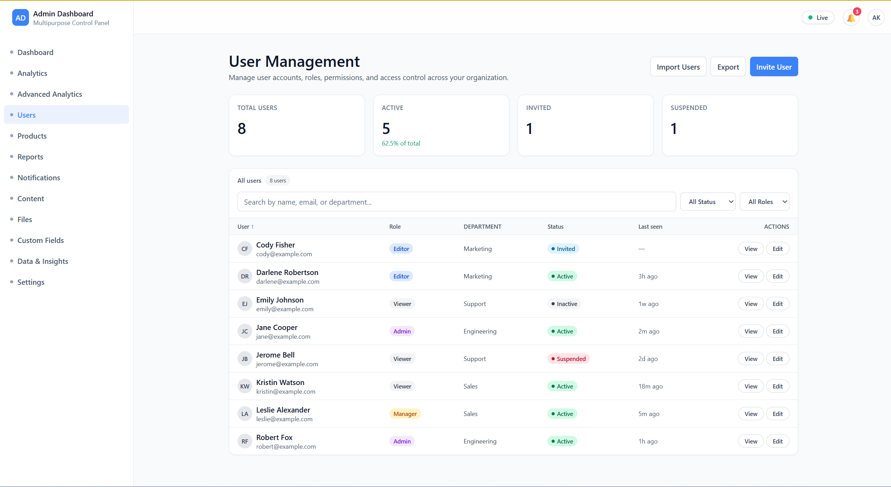
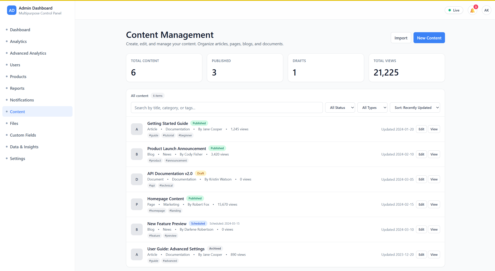
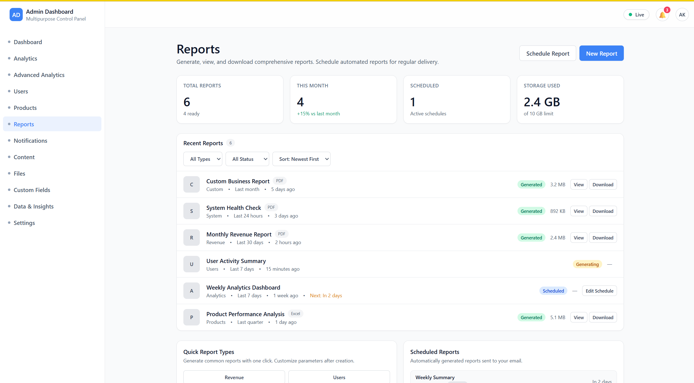
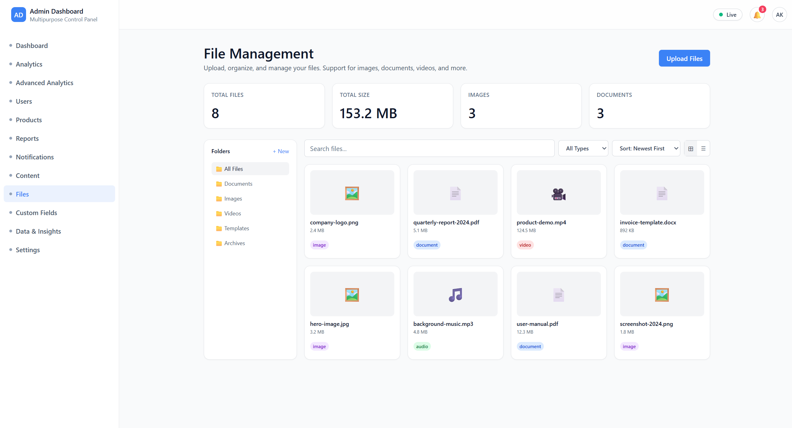
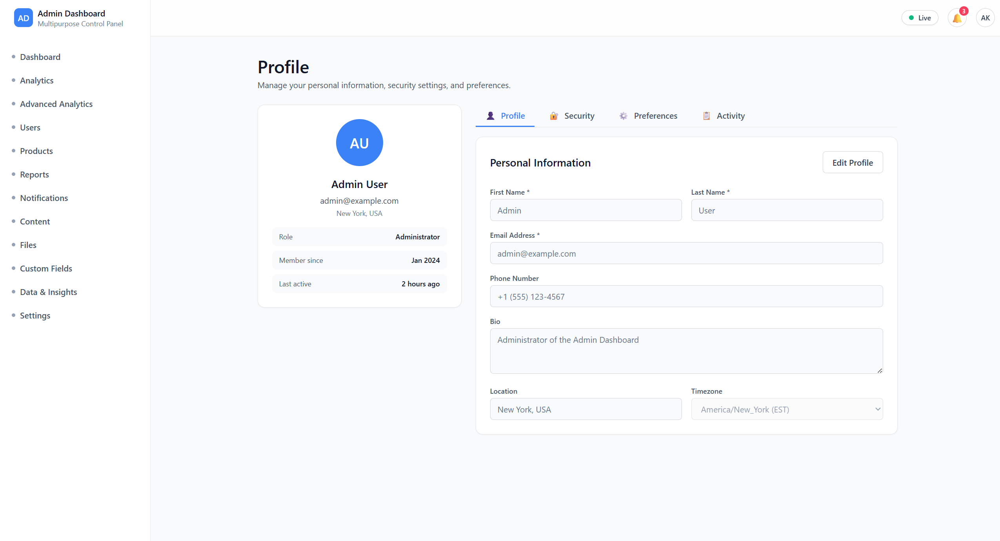
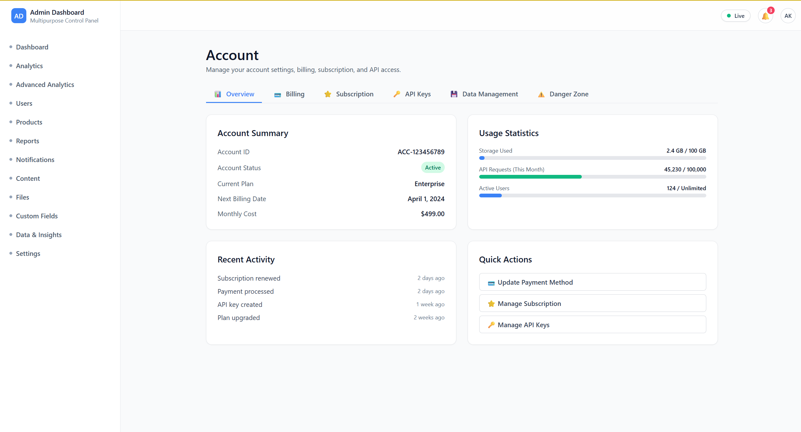

# 🎛️ Admin Dashboard

A modern admin dashboard built with React, Vite, and TailwindCSS.


## 📸 Screenshots












## 🚀 Quick Start

```bash
# Install dependencies
npm install

# Start development server
npm run dev

# Build for production
npm run build
```

Open [http://localhost:5173](http://localhost:5173) in your browser.

## 📦 Tech Stack

- **React 19** - UI library
- **Vite 7** - Build tool
- **TypeScript** - Type safety
- **TailwindCSS** - Styling
- **React Router** - Routing

## 📁 Project Structure

```
src/
├── pages/          # Page components
├── layout/         # Layout components
├── contexts/       # React Context providers
└── App.tsx         # Main app with routing
```

## 📝 Scripts

- `npm run dev` - Start dev server
- `npm run build` - Build for production
- `npm run preview` - Preview production build
- `npm run lint` - Run linter

## 📚 Documentation

See [`KNOWLEDGE_TRANSFER.md`](./KNOWLEDGE_TRANSFER.md) for detailed documentation.

---

**Built with React + Vite + TailwindCSS**
